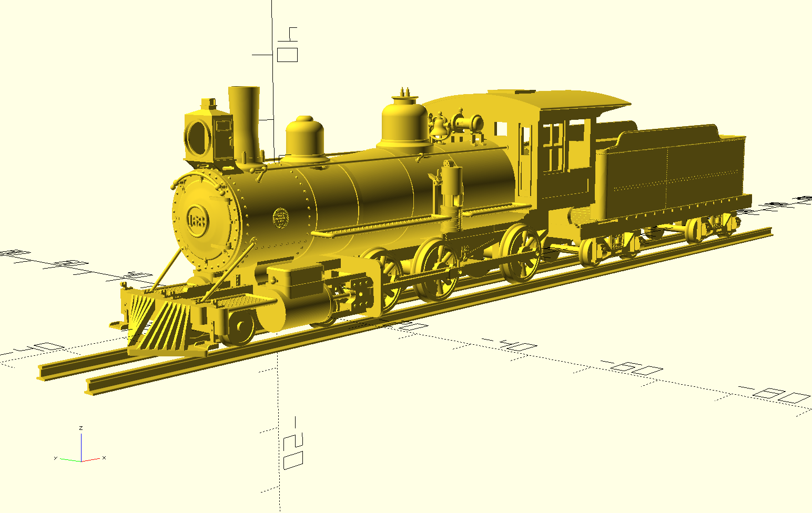

# DRG 168



Commputer-Aided-Design (CAD) files to produce a HOn3 model of Denver Rio Grande locomotive #168.  This steam locomotive operated on the DRG from about 1883 to 1933.  It was donated to the city of Colorado Springs, Colorado, where it was put on display in the downtown Antlers Park.  In 2015, it was leased to the Cumbres and Toltec Scenic Railroad (C&TS) for restoration to operation.  It now runs special trains on the C&TS from Antonito, Colorado.

The locomotive design was created using OpenSCAD, a script-based CAD, open-source.  This program may be downloaded at https://openscad.org/ 

All purpose-developed artifacts in this repository are copyrighted 2022 by Glenn Butcher, all rights reserved.  The artifacts are licensed for use under the terms and conditions of the Creative Commons Attribution 4.0 International (CC BY 4.0) license, terms are available here: https://creativecommons.org/licenses/by/4.0/

There are two external libraries used by this code.  For convenience, I've included the libraries in this repo so you don't have to download and install them.  Their respective licenses are:

- path_extrude: Developed by David Eccles, licensed by him for use under the terms of the GNU General Purpose License v3.0.  https://gitlab.com/gringer/bioinfscripts/blob/master/path_extrude.scad
- polyround: Developed by Kurt Hutten as part of his Round-Anything library, licensed by him for use under the terms of the MIT License.  https://github.com/Irev-Dev/Round-Anything

Additionally, all artifacts in this repository are available "as-is", with no warranty of performance.

NOTE: At this date (7/6/2023) this project is still work-in-progress, that is, there are numerous things missing to make a complete locomotive.

## Directories and Files

The repo is comprised of three directories:

1. stl: This directory is for generating STL mesh files from the OpenSCAD scripts in scad/. The Makefile in this directory is for use with GNU/Unix make to create each .stl from its corresponding .scad script, see "Building STLs" below for instructions.  For those not familiar, the Makefile will check each .stl file date with the corresponding .scad file date and only run OpenSCAD to build/rebuild the .stl if the .scad file is newer.  This saves considerable time making changes to single .scad scripts and making only the affected .stls.  The Makefile has specifics that pertain to my installation; change them to your situation if you intend to use it.  Also of note is that some .stl files will report mesh errors, although I'll make sure they're not egregious enough to affect printing.

2. scad: This directory contains the .scad files to build each corresponding .stl.  Some files are named xxx_assembly.scad, which signifies that the part is an amalgam of two or more subsidiary parts and corresponding .scad files.

3. lib: This directory contains the .scad files that are required by the .scad files in scad/  Some of them are sub-assemblies, others are libraries of useful OpenSCAD modules.  utilities.scad is a collection of modules I wrote specifically for building #168, most which could be used in other locomotive models.  Two files, polyround.scad and path_extrude.scad, are libraries from the external sources identified in the license paragraphs above; these two files were crucial to developing the curvy surfaces that are vintage steam locomotives.  Note: The scripts in scad/ reference these scripts through relative paths, so putting updates in the regular OpenSCAD library directories won't be referenced.

## Building STLs

### Prerequisites
- OpenSCAD (required): You can get this program at https://openscad.org, or install it from your operating systems' package repository (Linux). For the Makefile in the stl/ directory to work, the OpenSCAD executable needs to be in a directory that can be seen from a command line terminal window.  NOTE: OpenSCAD developers are currently integrating a new mesh library, Manifold.  This library is multiple orders of magnitude faster than the old CGAL library; to use it you need to download one of the nightly builds available further down the Download page.  DRG_168 scripts generate LARGE meshes, so using this version is advised.  I'll remove this note when OpenSCAD releases a Manifold-based version.
- Mesh-fixing program (optional): The OpenSCAD scripts in this repository will generate STL meshes that can be successfully printed, but some may contain various errors reported by some software.  Any number of mesh-fixing programs are available to correct these errors; Windows 3D Builder is my current favorite. If you're using Windows 11, 3D Builder is probably already available on your computer.  For Linux operating systems, Meshlab would be my choice, but it is a lot more difficult to use.

### Building with the Makefile

```
cd stl
make
```
Takes about 2.5 minutes on my 4Ghz Ubuntu desktop.

### Building Individual Parts

Run OpenSCAD, open the .scad file you want to work with in the scad directory.  Note: If you move a .scad file to another directory, you may break linkages to other files it depends on in the lib/ directory.  Afer opening, hit the F6 key to render a mesh, then export it with File->Export->Export as STL...


## Hacking

Modeling #168 is a work-in-progress that I'm documenting at a blog:  https://glenn.pulpitrock.net/blog/. This is a good place to read about how I organized various scripts, very important to understand if you're going to modify them.

Using any of these .stl or .scad files in other projects is encouraged, as long as the Creative Commons attribution terms are respected.

stl_integration.scad is useful to inspect part relationships for fit.  As-delivered, all of the import lines are commented out; this is so when you open it in OpenSCAD, it won't immediately go into a multi-minute render of the whole model.  Once the file is opened, you can un-comment individual part imports by removing the '//' from the front of the respective line.  Of note, the tender cistern, followed by the smokebox_boiler_firebox_assembly, are the most time-consuming renders. If your system is quick enough, just uncomment all the lines and enjoy the full render...  :D

A lot of the locomotive was modeled with extrusions from polygons.  It is rather difficult to craft a point arry for such polygons by just typing in numbers, so I wrote a program with which to plot polygon points, wxPolygon.  It lets one construct a polygon visually, copy the numbers to the clipboard, then paste them into an OpenSCAD script properly formatted. It also will incorporate a radius for each point, allowing the point array to be used with polyRound() to round the corners.  Saved me a bunch of time over hand-coding, and can be found here:

https://github.com/butcherg/wxpolygon

At some point in the near future, I'm going to start posting releases, which will contain the .stl files from the .stl directory, further run through a mesh fixer so there will be no mesh errors to cause angst.


